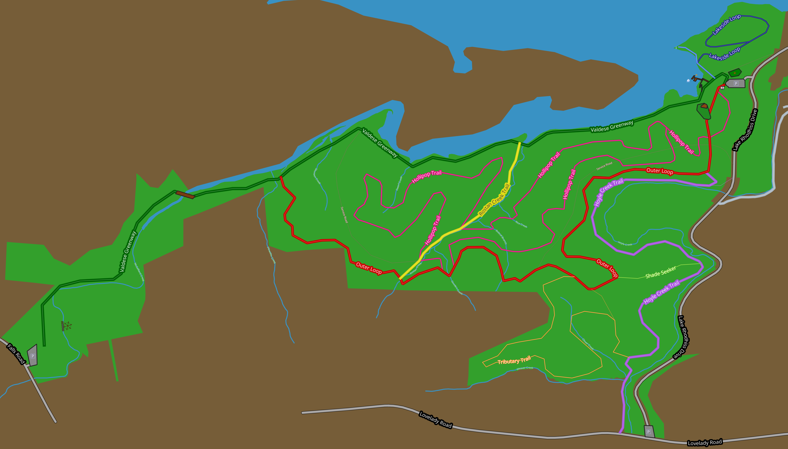

# Valdese Lakeside Park App

This is a web application intended to help explore current and future features
of the Lakeside Park in Valdese, NC.

## Acknowledgements

- [Leaflet open-source JavaScript library](https://leafletjs.com/) 
Provides the primary mapping and image projection library for the app.

- [Open Street Map](https://www.openstreetmap.org/copyright) 
Source for the Valdese area streets and water features on the map.
